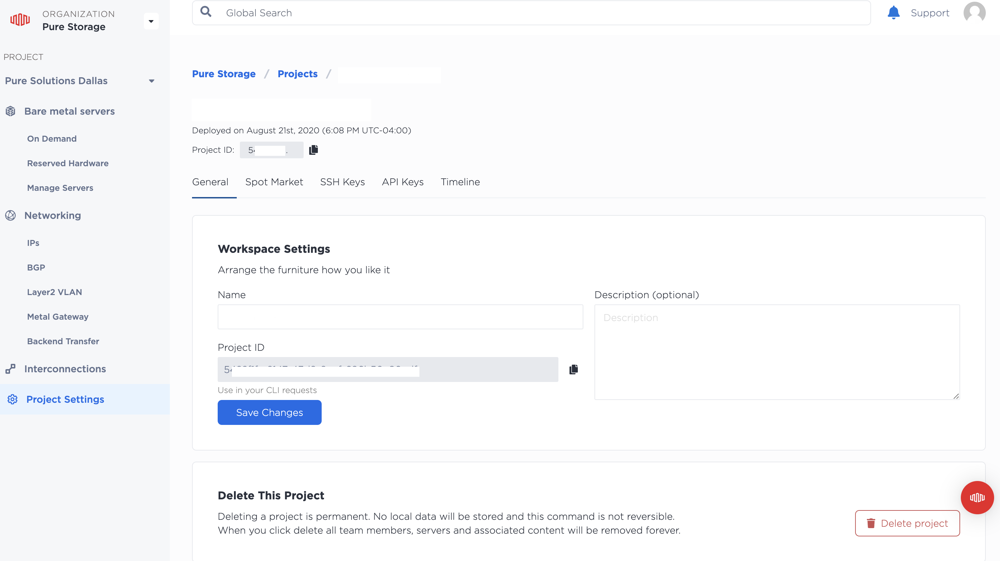
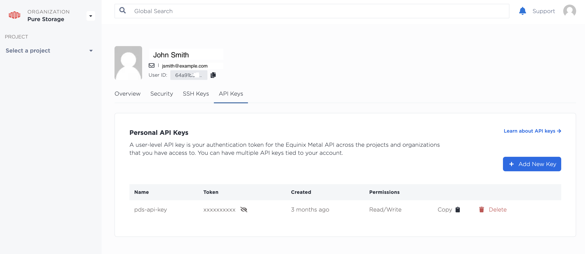
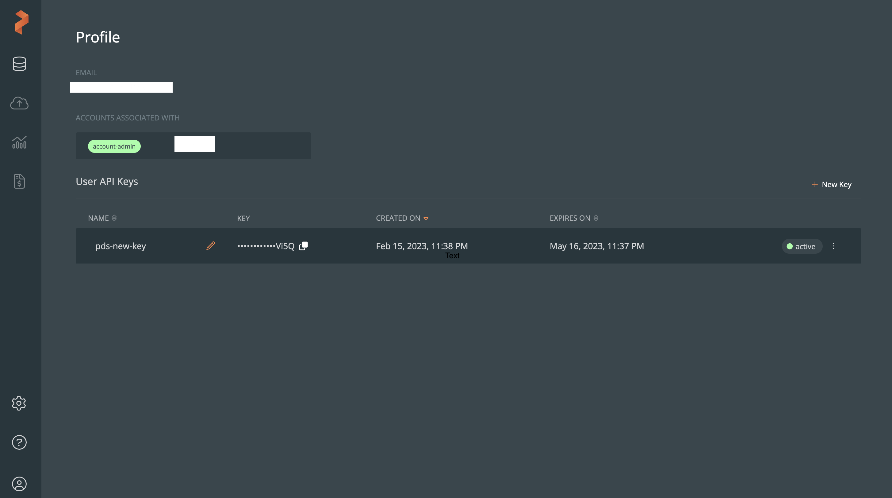
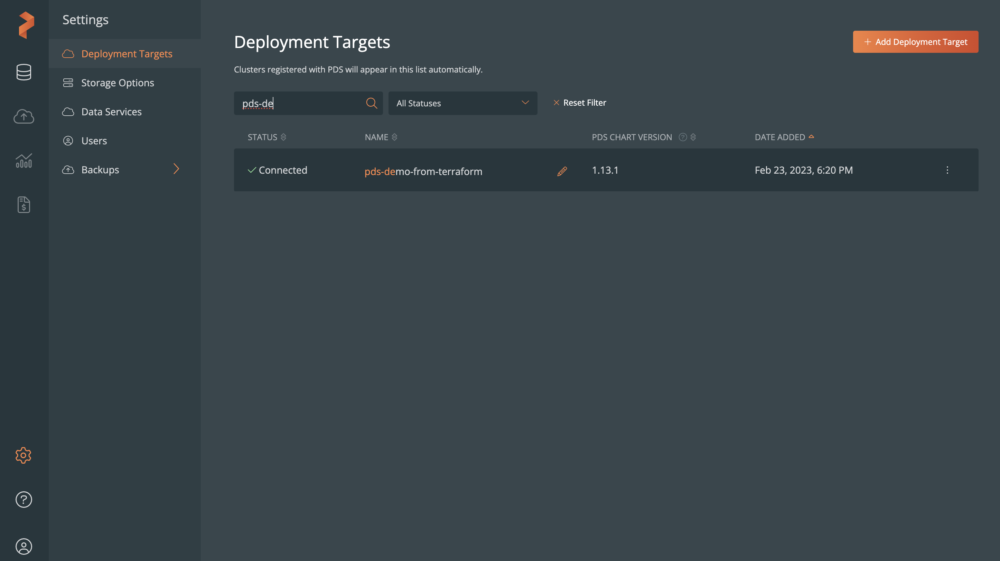

# Terraform Module to Automatically Deploy Portworx Data Services (PDS) on Equinix Metal Server
## Introduction
The Terraform module automates the end-to-end deployment of Portworx Data Services (PDS) on the Equinix Metal server. When you run the Terraform module, it first provisions the Equinix Metal servers. It then sets up the Kubernetes cluster with Portworx Enterprise as the storage platform. Finally, it integrates the Kubernetes cluster into PDS portal.  After the successful integration, users can select from the database services that are supported in PDS.
## Prerequisites
### Equinix Metal Server Requirements
1. Deploy a **c3.medium.x86** or higher Equinix Metal server. 

For current standard plans offered by Equinix, see [Equinix Standard Gen3 Servers](https://deploy.equinix.com/product/servers/).

2. The Equinix Metal server should have at least a minimum of 3 disks: 1 for OS, 1 for KVDB and 1 or more disks for Portworx storage pools.
### Creating Equinix Metal Account
1. Create an [Equinix Metal accout](https://console.equinix.com/sign-up).
2. Set up an [organization](https://deploy.equinix.com/developers/docs/metal/accounts/organizations/) and create a [project](https://deploy.equinix.com/developers/docs/metal/accounts/projects/).
3. Obtain the following information from Equinix Metal console: 
- **project-id**: The Equinix Metal project identifier. 
- **api-token**: The user API key used to access the Equinix Metal API. 
- **metro**: The location where you want to provision your server.

> **Note** 
> You can obtain the project ID from the **General** tab in the **Project Settings** screen in the Equinix Metal console. 


To obtain the user API key, in the Equinix Metal console, click the **User** icon and select the **My Profile** option. Go to the **API Keys** tab to view the user API key. 


### Onboarding to Portworx Data Services (PDS)
1. Create a [Portworx account](https://central.portworx.com/landing/register). 
2. [Contact](https://portworx.com/contact-sales/) Portworx sales team to access Portworx data services (PDS).
3. After the Portworx sales team signs you up, log in and access the PDS dashboard.
4. Obtain the API Key from the PDS dashboard.
To obtain the user API key, in the PDS dashboard, click the **User** icon and select the **Profile** option. The user API key is available in the **Profile** screen. 

5. Obtain the tenant ID using the PDS REST API.

First, obtain the account ID using the following GET request.

Request
```
curl -X 'GET' \ 
'https://prod.pds.portworx.com/api/accounts' \ 
-H 'accept: application/json' \
-H 'Authorization: Bearer <pds-api-key>'  
```
Sample Output
```
{
 "data": [
  {
    "id": "re085742-e92a-4278-b956-4dcacb9x72a",
     "created_at": "2022-04-02T19:57:31.414608Z",
     "updated_at": "2022-08-19T04:23:43.225184Z",
     "name": "Portworx",
     "eula": {
     "accepted": true,
     "accepted_version": "2022-06-01"
    },
    "global_config": {}
  }
 ],
 "pagination": null
}
```

Copy the account ID from the output and use it in the below request.

Request
```
curl -X 'GET' \
'https://prod.pds.portworx.com/api/accounts/<account-id>/tenants' \
-H 'accept: application/json' \
-H 'Authorization: Bearer <pds-api-key>'
```
Sample Response
```
{
  "data": [
   {
    "id": "203xcadc-dd11-42e6-ba1c-563f3056b8da",
     "created_at": "2022-04-02T19:57:31.419869Z",
      "updated_at": "2022-04-02T19:57:31.419869Z",
      "name": "Default",
     "account_id": "re085742-e92a-4278-b956-4dcacb9x72a"
    }
 ],
 "pagination": null
}
```

### Linux Control Host Machine Prerequisites
The Linux host machine must have the following software installed:
- Python 3.8 or higher
- Git
## Setting Up the Portworx Data Services (PDS) on Equinix Metal Server
Perform the following steps on the Linux control host machine to set up Portworx Data Services (PDS):
1. Export the following variables:
``` 
# export ANSIBLE_PRIVATE_KEY_FILE='~/.ssh/eqx_priv'
# export ANSIBLE_HOST_KEY_CHECKING=False
```
> **Note**
> These variables allow you to run Ansible playbooks from the Terraform module. The ANSIBLE_PRIVATE_KEY_FILE variable provides the location of the private key to be used for SSH authentication. The ANSIBLE_HOST_KEY_CHECKING variable disables host key checking. You can place these variables in bashrc and bash_profile files as well.

2. Clone the GitHub repository:
```
# git clone https://github.com/PureStorage-OpenConnect/terraform-portworx-on-baremetal.git
```
3. Go to the directory that contains the Terraform module setup files:
```
cd terraform-portworx-on-baremetal
```
4. Install the tools that are prerequisites to install the Terraform module: 
```
# bash scripts/prereq.sh
```
> **Note**
> This command installs the following tools: Helm, jq, Terraform, kubectl, and curl
5. Ensure that the required tools are installed:
```
source ~/.bashrc
```
6. Check the Terraform version:
```
# terraform version
```
> **Note**
> The Terraform version should be 1.3.5 or higher.
7. Initialize the Terraform module.
```
# terraform init
```
8. (Optional) Review the **variable.tf** file. The configuration parameters in the variable.tf file contain default values. You can change these default settings.  

For example, the Terraform module sets up a 4-node Kubernetes cluster and sets the metro to Dallas (DA). 
To change these settings, edit the following parameters: 
- **cp_node_count**: Modifies the number of master servers in the cluster.
- **nodes_count**: Modifies the total number of servers in the cluster.
- **metro**: Modifies the location where you want to provision the server. 
> **Note** 
> Security sensitive variables are not stored in the variable.tf file. Instead, they are passed through the CLI.
9. Review the terraform plan that will be applied to install the setup:  
```
# terraform plan -out test.out -var "metal_auth_token=*****" -var "tenant_id=****" -var "pds_token=******" -var "metal_project_id=******"
```
> **Note** 
> In the above command, provide the values for the security-sensitive configuration parameters.
10. Apply the reviewed plan: 
```
# terraform apply test.out
```
The module provisions the Equinix Metal servers, sets up the Kubernetes cluster with Portworx Enterprise as the storage platform, and integrates the Kubernetes cluster into PDS portal.  
The whole process might take up to 30 minutes. After completion, the Equinix nodes and their IP addresses are displayed.

11. Verify whether the kube-config-file is available:
```
# ls -lrt modules/k8s_setup/kube-config-file
```
12. Export the following variable to run the kubectl commands:
```
# export KUBECONFIG=modules/k8s_setup/kube-config-file
```
13. Verify the Kubernetes cluster:
```
# kubectl get nodes
NAME		   STATUS 	                   ROLE                  AGE     VERSION
Example-node-01    Ready,SchedulingDisabled        control-plane,master  35m     v1.23.0
Example-node-02    Ready	                   <none>                34m     v1.23.0
Example-node-03    Ready 	                   <none>                34m     v1.23.0
Example-node-04    Ready 	                   <none>                34m     v1.23.0
```

14. Verify that the scheduling for master is disabled.
As seen in the above example, the status of the master node should be **Ready,SchedulingDisabled**


15. Verify that Portworx is operational.

To verify, run the following commands:
```
# PX_NS_AND_POD=$(kubectl get pods --no-headers -l name=portworx --all-namespaces -o jsonpath='{.items[*].metadata.ownerReferences[?(@.kind=="StorageCluster")]..name}' -o custom-columns="Col-1:metadata.namespace,Col-2:metadata.name" | head -1)
```
This command fetches the running PX POD name and namespace and stores this in a variable. 
```
# kubectl exec -n ${PX_NS_AND_POD% *} ${PX_NS_AND_POD#* } -c portworx -- /opt/pwx/bin/pxctl status | grep -w Status:
```
This command determines the Portworx status using the previously stored variables.

16. Sign in to the PDS portal and verify whether the Kubernetes cluster is added as a deployment target.

In the PDS portal, go to **Settings >> Deployment Targets** screen to see the Kubernetes cluster. 


## Deploying Data Services in PDS
1. Sign in to Portworx Data Services (PDS) portal.
2. Browse to the **Deployment Overview** page.
3. In the **Deploy Data Service** section, select the data service you want to deploy.
4. Follow the on-screen instructions to manually deploy the data services.
For more information, see the [Deploy a Data Service](https://pds.docs.portworx.com/user-guide/deploy-data-service/) help topic.
## Destroying the Environment
To destroy the environment completely, run the following command: 
```
# terraform destroy -var "metal_auth_token=*****" -var "tenant_id=****" -var "pds_token=******" -var "metal_project_id=******"
```

